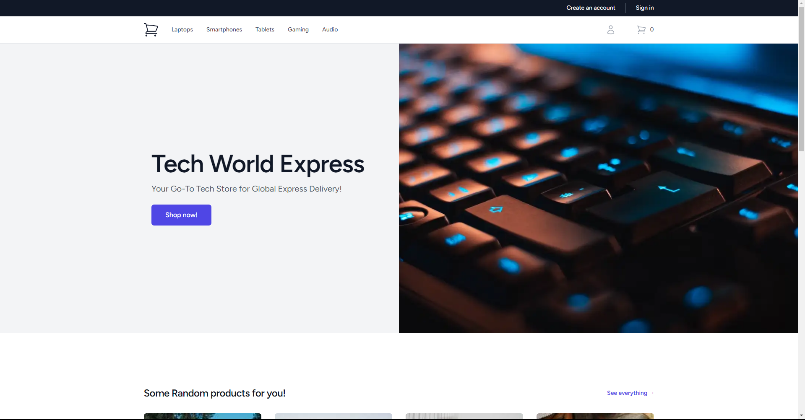

<p></p>

## About Tech World Express
Tech World Express is an ecommerce website that sells tech products. Tech World Express includes a working cart system, a working checkout system. Tech World Express is built with Laravel, Vue.js (Inertia.js), and Tailwind CSS.
Look at the [screenshots](https://github.com/DevShaded/squeaker/tree/main/docs/screenshots) section to see how the application looks like.



## Setting up the project
Here is the section on how to set up the project, and run it properly.

### Requirements
This projects requires a few things to have to be installed on your computer.
```
MYSQL Server
Node.js v18x (or higher)
PM2 (Node Process Manager)
```

### Installing dependencies
To install the dependencies, run the following commands:
```bash
composer install
```

```bash
npm install
```

### Environment variables
To set up the environment variables, we need to follow these simple steps:
1. Copy the contents of the `.env.example`
2. Create a new file called `.env`, and paste the contents of the `.env.example` into it.
3. Set up the database information in the `.env` file.
4. Create a new database with `utf8mb4_unicode_ci` as a collation.
5. Run `php artisan key:generate` to generate a new session key for the application.

**Do not ever upload the `.env` file as it contains private credentials.**

### Running the migration files, database seeds and storage link
To run the migration files and database seeds, run the following commands:
```bash
php artisan migrate
```

```bash
php artisan db:seed
```

## Running the application
### PRODUCTION
To run the application in production mode, run the following commands:
```bash
npm run build
```

Since we are using ssr (server side rendering), we need to run the following command in the background:
```bash
node /bootstrap/ssr/ssr.js
```
Or we can use this command instead with `pm2`:
```bash
pm2 start /bootstrap/ssr/ssr.js --watch
```

### DEVELOPMENT
To run the application in development mode, run the following commands:
```bash
npm run build
```

Since we are using ssr (server side rendering), we need to run the following command in the background:
```bash
node /bootstrap/ssr/ssr.mjs
```

Then we need to run the dev command:
```bash
npm run dev
```

And for the last command we need to run the following command:
```bash
php artisan serve
```
